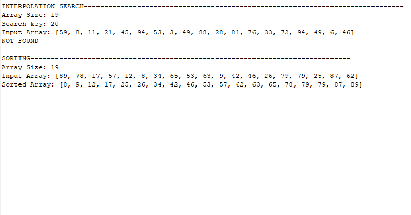
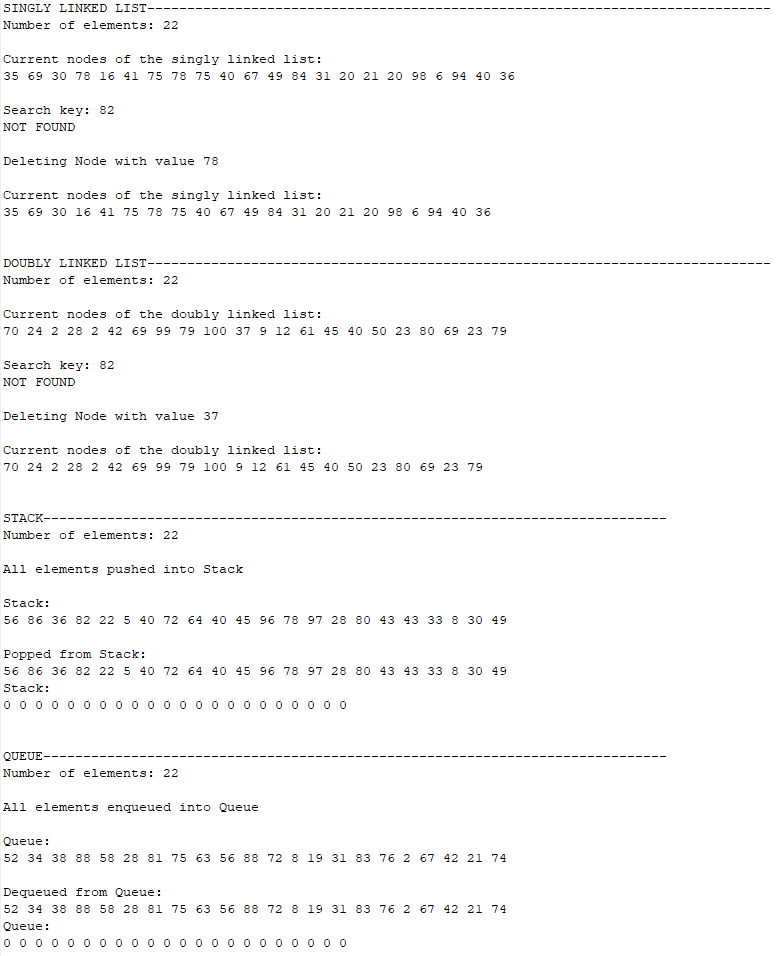
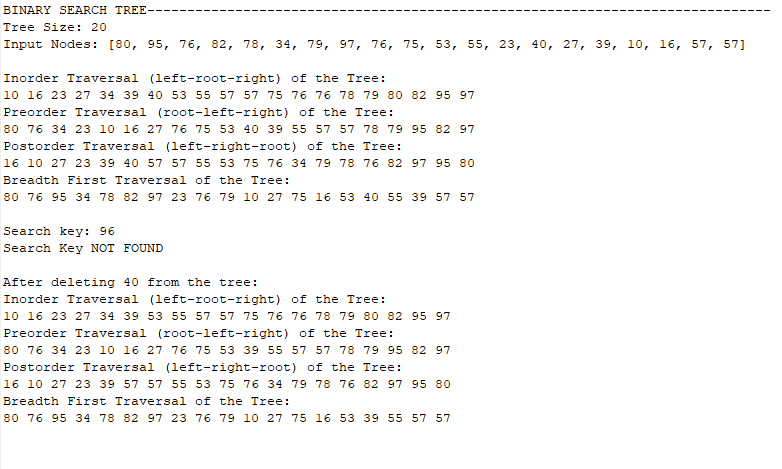
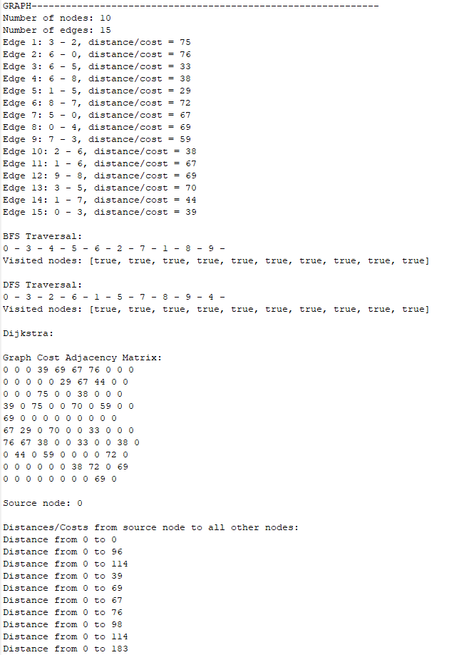

# ENSF 694 Final Project

Christian Valdez

A collection of common data structures.

`Search`:

- Interpolation

`Sort`:

- Merge Sort

 

`Linear data structures`:

- Singly-linked lists
- Double-linked lists
- Stack
- Queue

 

`Tree structure`:

- binary search tree

 

`Graph algorithms`:

- Breadth-first search
- Depth-first search
- Dijkstra

 

Usage:

1. Start Eclipse and navigate to your workspace.
2. Create a new project.
3. Expand the project name in Package Explorer and left-click on the src folder.
4. Right-click on the src folder and select Import.
5. In the Import dialog, expand General and select Archive File. Click Next.
6. Browse for the myLibrary.jar and click Open.
