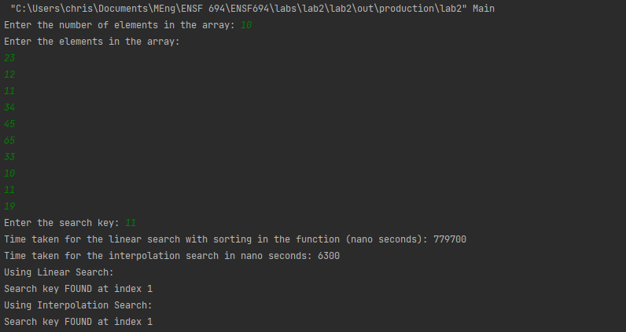
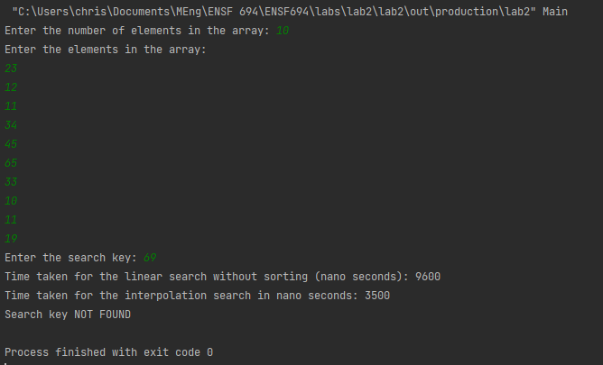
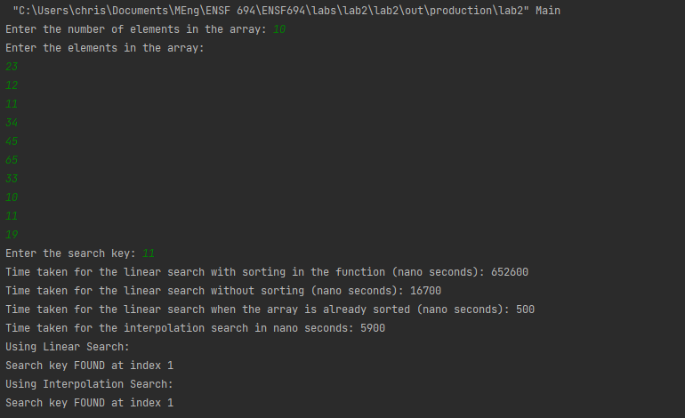
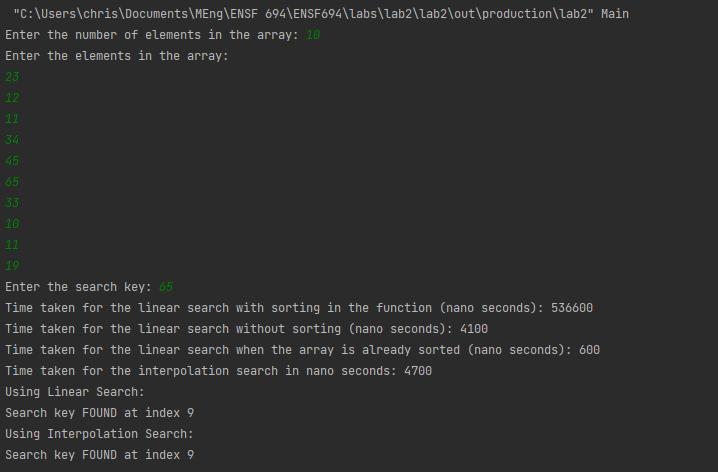

## Lab 2

Christian Valdez

## Q1

Running the program, a successful search looks like the following:
 
 

 
 
An invalid search produces the following output:
 
 

# Q2

Comparing the run times, we can see that a linear search with a sorting function is much slower than an interpolation search. Looking at the time complexity (worst case), they are both O(n). However, looking at the average complexity of an interpolation search, it is proven to be O(lg(lg n)) which is much faster than O(n). As a side note, both methods used Java's Arrays.sort() method.

# Q3

One way of improving the algorithm is not using Java's sort method. It could be more efficient with a really big array. However, it does not help with a small one.
 
 
Another way of improving the run time is passing in an already sorted array. Using our test case, this is even faster the the interpolation search algorithm. A reason for this is due to the number of operations required in an interpolation search algorithm.
 
 

